# spark-goods
spark流式计算
- 电商商品关注度
- 推荐系统
- 关联系统

## core
anaylse (spark)
- spark:2.6.5
- hadoop:2.6.0
- scala:2.11.8

website (webapp)
- boostrap
- startbootstrap
- echarts
- springboot
- mysql

## quick start
- run create.sql + data.sql
- run spriingboot
- open http://localhost:8080/ in Web Browser

## how to gernerate data
1. install mysql and create db spark
2. run create.sql
2. run Server.java + Client.java
3. run trainEvaluation.scala
4. run trainAIS.scala
5. run fpg.scala

## screenshot
1. index
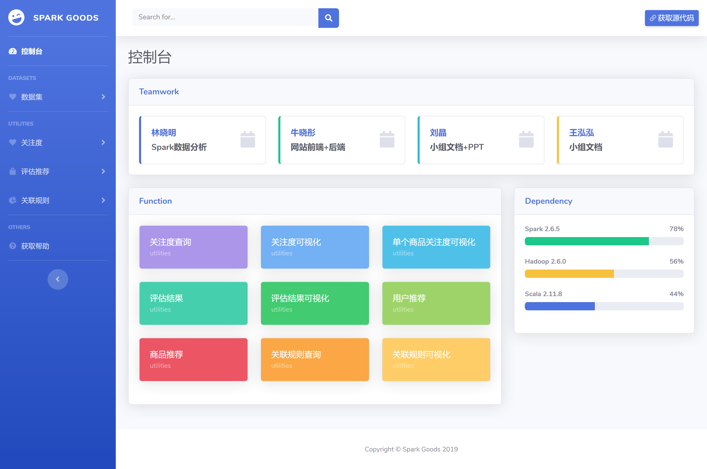
2. data
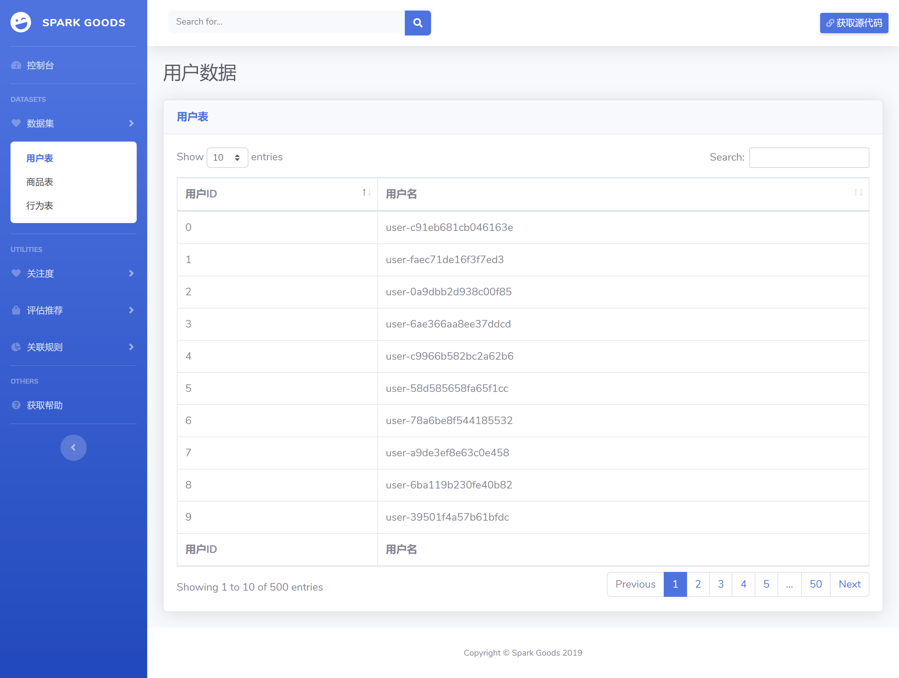

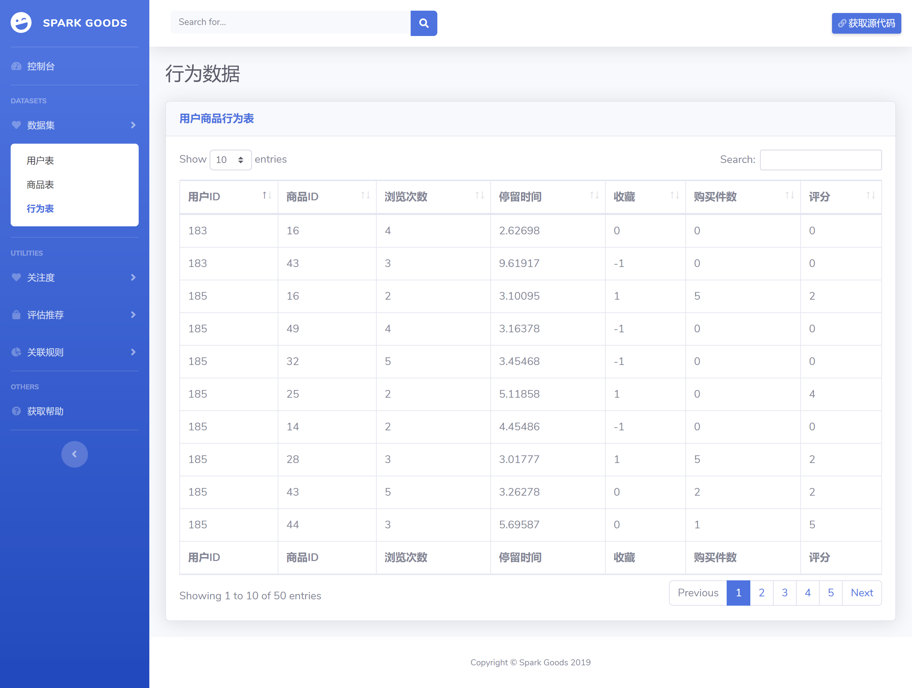
3. follow
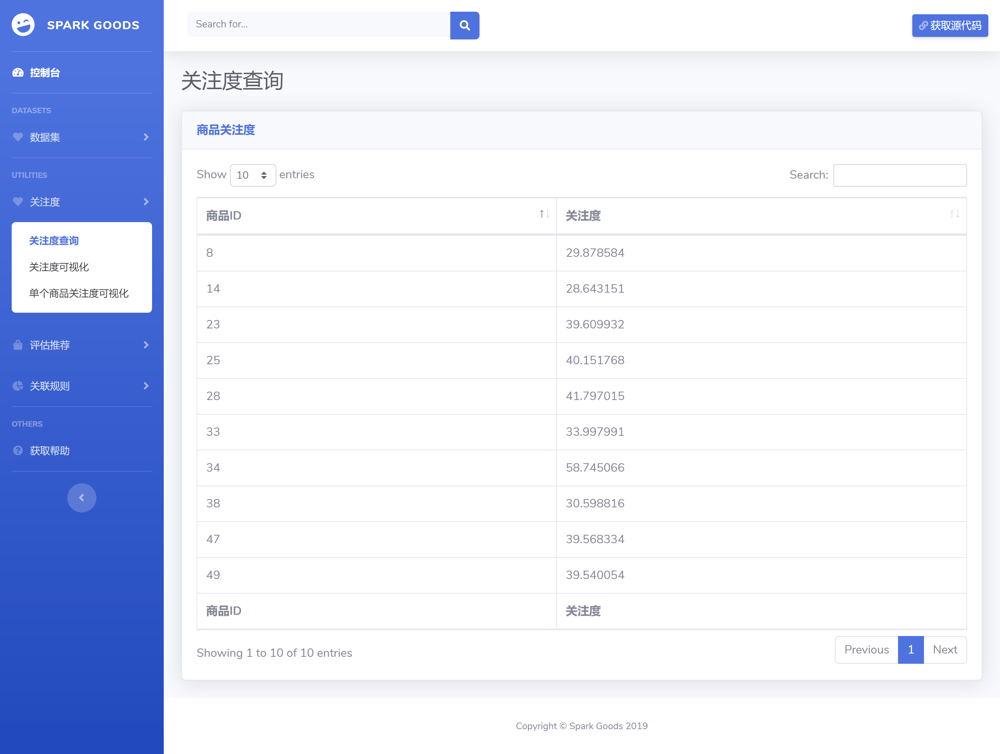
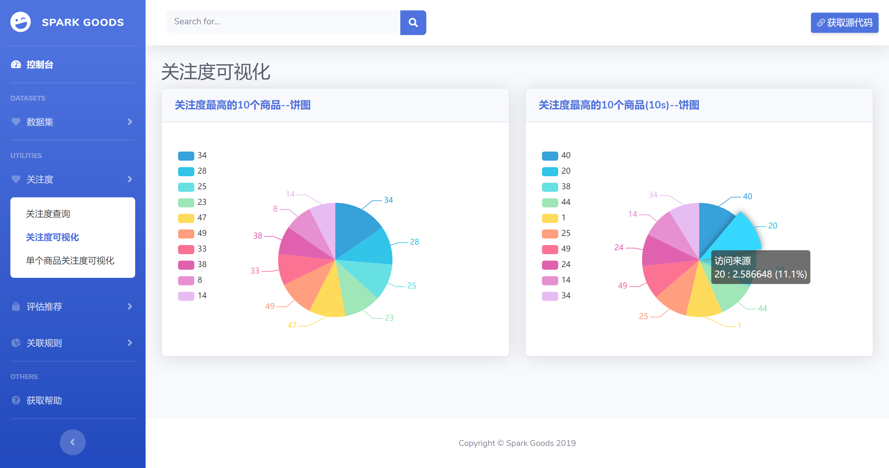
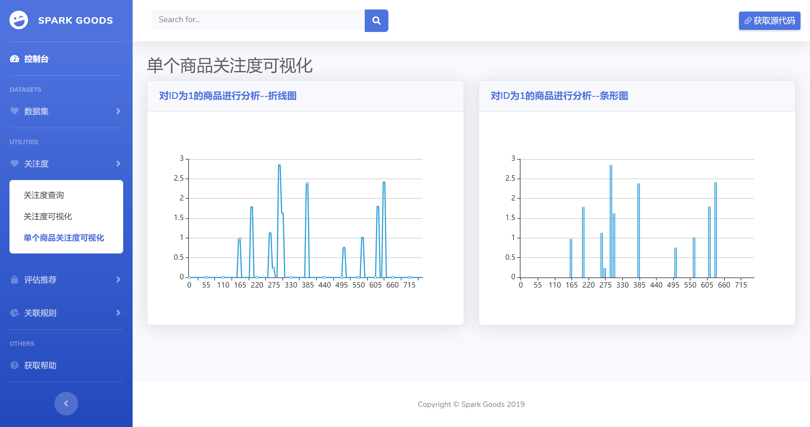
4. evaluate
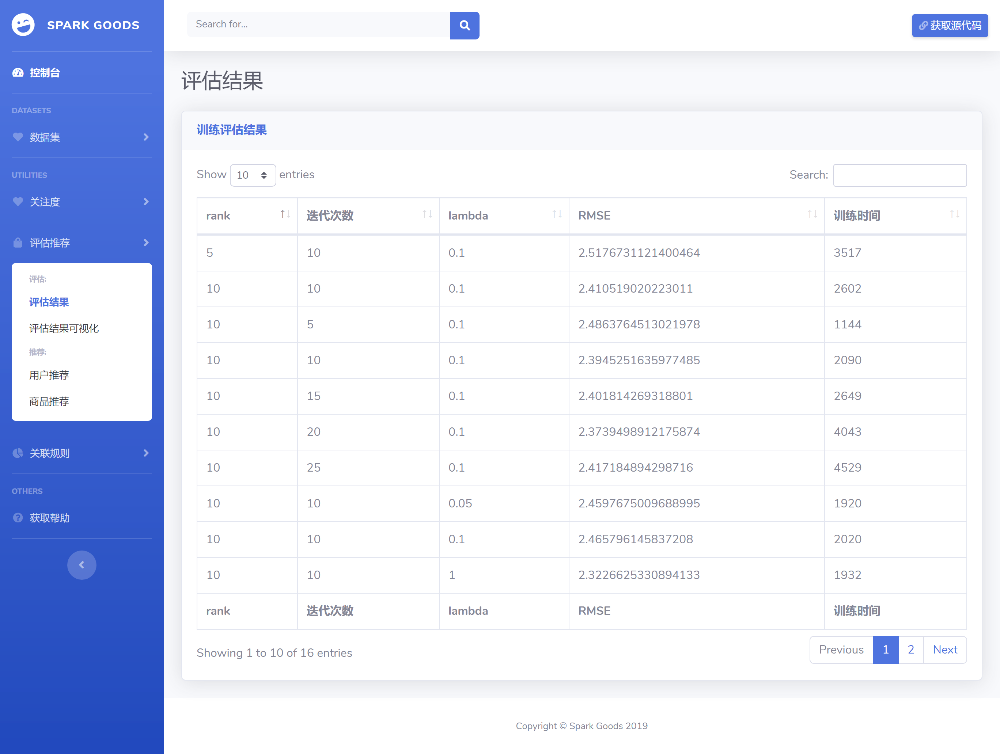
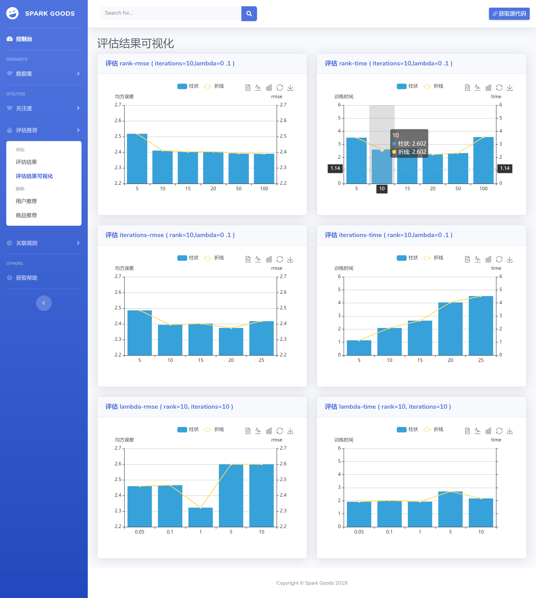

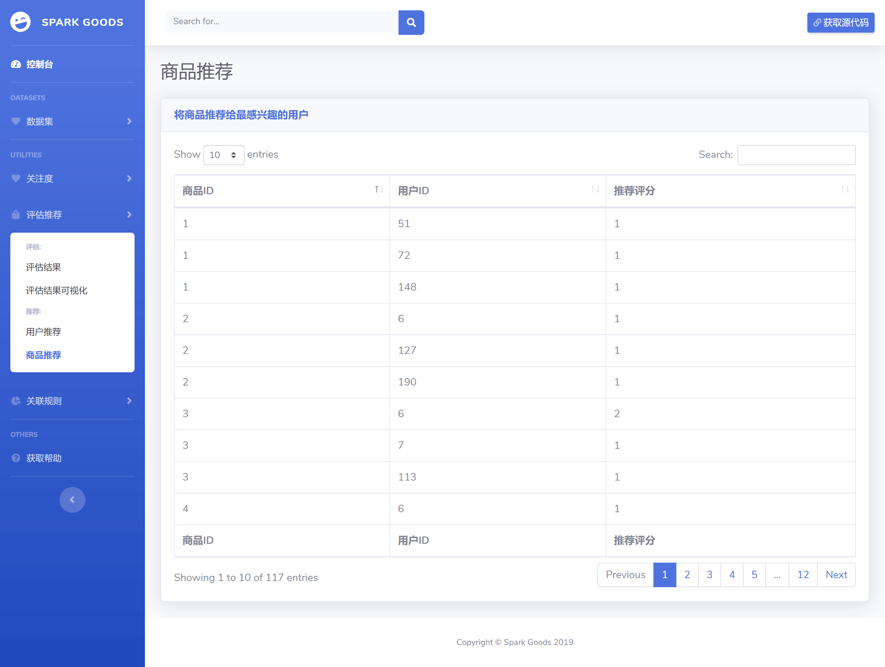
5. fpg
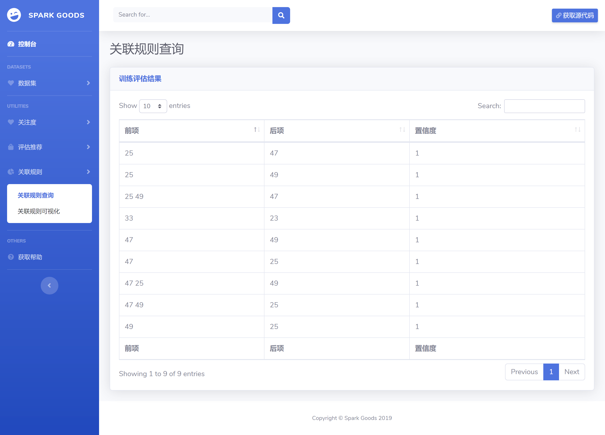
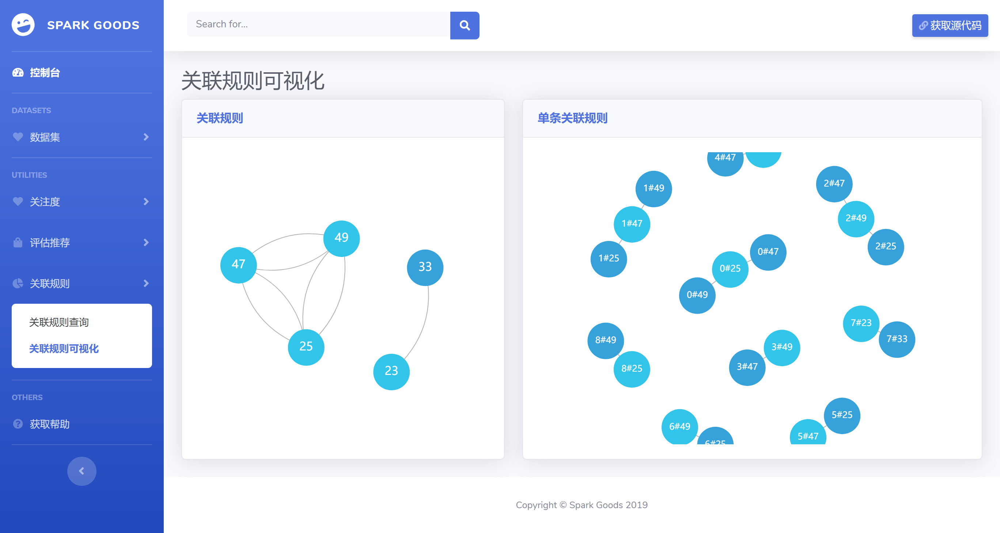
